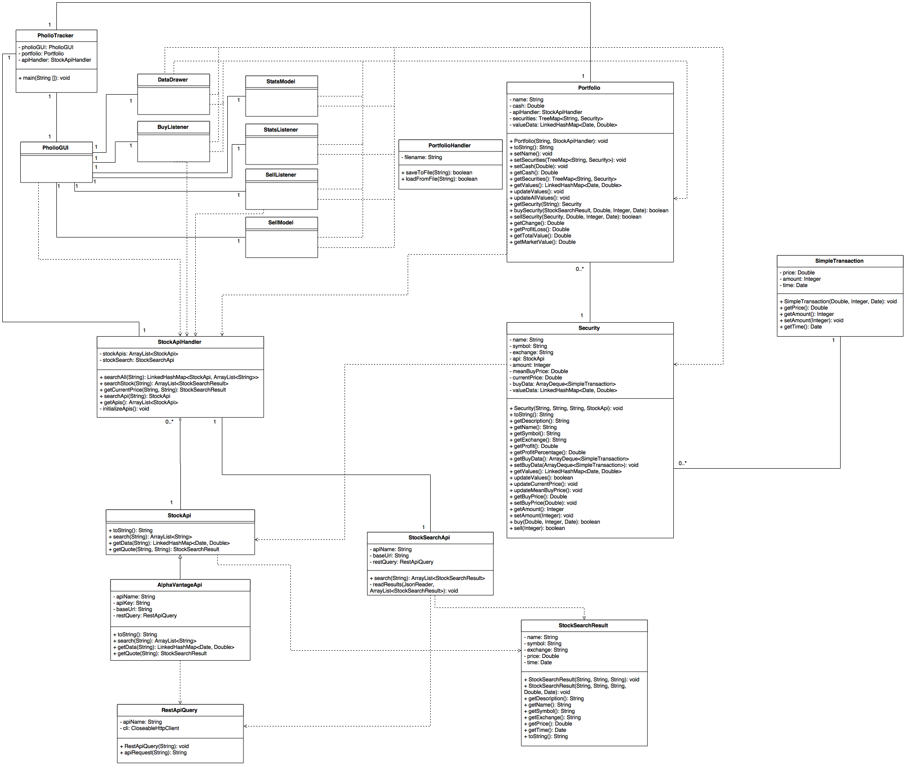
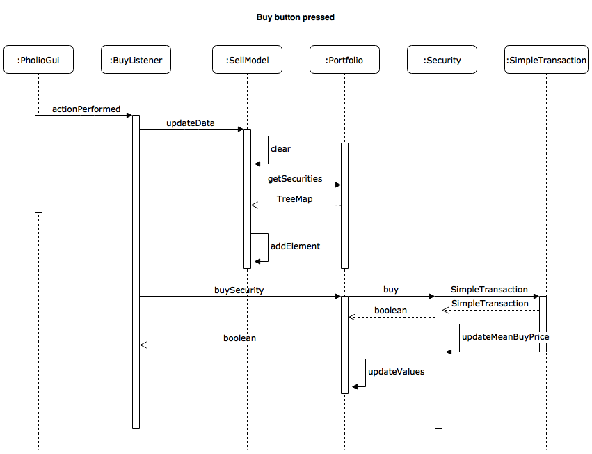
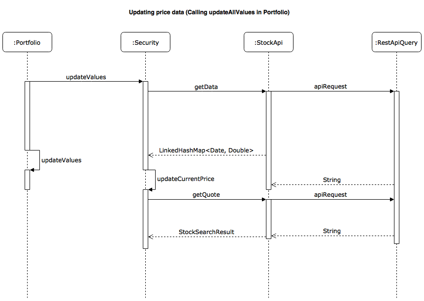

# pholiotracker

## Aihe
Pholiotracker on hyötyohjelma sijoitussalkun seuraamiseen ja ylläpitoon. Sen
avulla näkee sekä yleiskuvan salkun arvosta, että yksittäisten osakkeiden
kehityksen. Kurssitiedot ja muut tunnusluvut pyritään hakemaan mahdollisimman
reaaliaikaisesti käyttämällä hyväksi internetistä löytyviä avoimia rajapintoja.

## Käyttäjät
Ohjelma on suunniteltu pääasiassa piensijoittajille.

## Toiminnot
* Yhtiöiden etsiminen ja niiden osakekurssien tarkastelu
* Osakkeiden lisääminen salkkuun
* Osakkeiden poistaminen salkusta
* Salkun kokonaisarvon kehityksen tarkastelu

## Rakennekuvaus
Ohjelma jakautuu yhteensä neljään eri pakettiin:
* pholiotracker
  * Tässä paketissa sijaitsee pääohjelma, joka luo ohjelman käynnistyksessä
    tarvitsemat Portfolio ja StockApiHandler oliot, sekä käynnistää
    varsinaisen käyttöliittymän.
* pholiotracker.api
  * API-pakettiin on koottu kaikki osakedatan hakuun liittyvät
    toiminnallisuudet.
* pholiotracker.gui
  * GUI-paketti sisältää kaikki käyttöliittymän toiminnallisuudet.
* pholiotracker.portfolio
  * Portfolio-paketti sisältää ohjelman toimintalogiikan. Sen avulla
    hallinnoidaan osakesalkkua ja sen sisältämiä osakkeita.

## Luokkakaavio

## Sekvenssikaaviot

